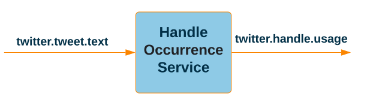

# Handle Occurrence Service

A Kafka Streams based microservice that consumes the `twitter.tweet.text` topic, 
scans the value for occurrences of Twitter handles, e.g. `@elonmusk`, and, for each encountered
handle, produces a record to the `twitter.handle.occurrence` topic detailing the handle and the number of occurrences.

## Backwards compatability

Because the jar is not shared outside the repo there is no backwards compatibility concerns.